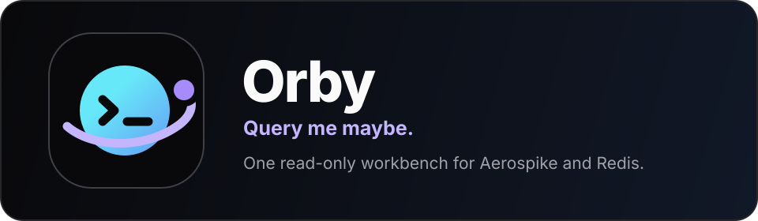
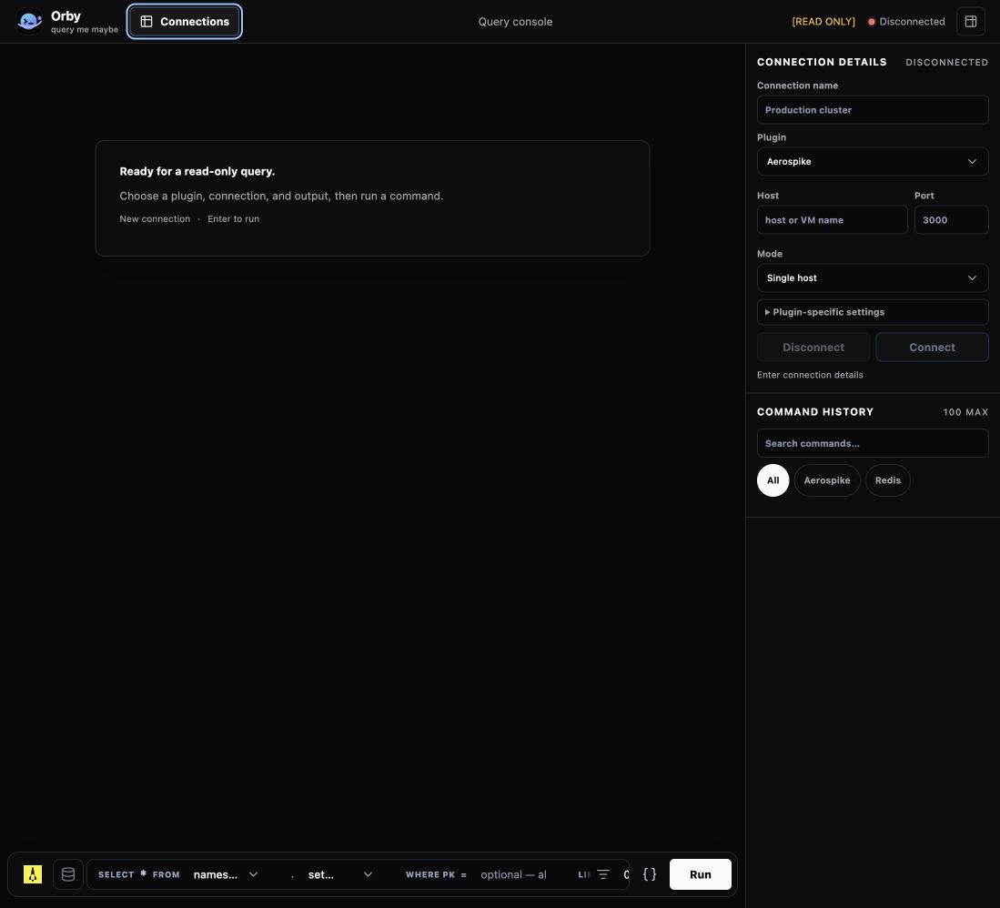
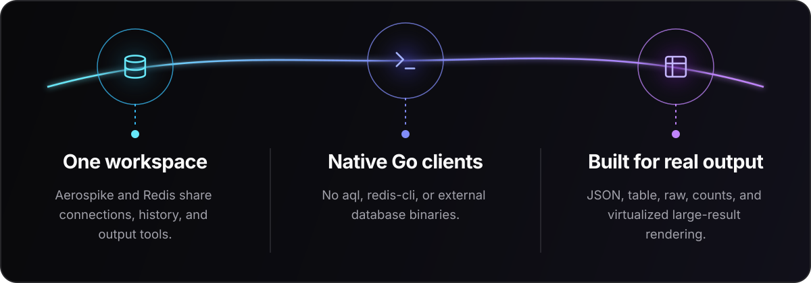

<p align="center">
  
</p>

<div align="center">
  <p>
    
    
    
  </p>

  <p align="center">
    <a href="#why-orby">Why Orby?</a> ·
    <a href="#quick-start">Quick start</a> ·
    <a href="#supported-workflows">Workflows</a> ·
    <a href="#adding-a-plugin">Plugins</a> ·
    <a href="#deployment-and-security">Deployment</a>
  </p>
</div>

<p align="center">
  
</p>



## Why Orby?

Orby exists for teams whose services interact with multiple data stores—and who are tired of keeping a different desktop application open for every one of them. It provides one focused browser workbench where plugin-driven tools share the same connection manager, query history, and output experience.

> [!IMPORTANT]
> Orby connects to databases from its server process. When using it inside a private network, deploy Orby somewhere that can reach every database host and port you intend to use.

Orby currently supports Aerospike and Redis through their native Go client libraries. It does not invoke `aql`, `redis-cli`, or any other external database binary.

- **Read-only by design** — Redis commands are allow-listed and Aerospike exposes read, scan, and filter workflows only.
- **Plugin-driven UI** — each integration owns its connection fields, composer controls, live options, formats, and execution behavior.
- **Reusable connections** — pooled clients are reused across queries and closed after 10 minutes of inactivity.
- **Browser-local workspace** — saved connections and sidebar preferences remain in browser storage.
- **Operationally simple** — a single Go server hosts both the UI and backend.

## Supported workflows

### Aerospike

- Select namespaces and sets from live dropdowns.
- Read a record by primary key or scan a set.
- Build native Aerospike expression filters visually.
- Choose bin types explicitly; Orby does not infer schemas.
- Include record metadata when needed.
- Limit scans to 100 records by default, or use `-1` for a full scan.

### Redis

- Enter familiar `redis-cli`-style commands with quoted arguments.
- Run supported read-only string, hash, list, set, sorted-set, stream, scan, and server-information commands.
- Use single-host or cluster connections.

### Shared experience

- JSON, table, and raw rendering.
- Result counts, copy, rerun, expand, close, and clear-output actions.
- Searchable command history capped at 100 entries.
- Resizable, collapsible sidebars whose state is remembered.

## Architecture

```text
Browser (HTMX + JavaScript)
        │
        │ HTTP
        ▼
Orby Go server
        │
        ├── Aerospike plugin ── aerospike-client-go/v8
        └── Redis plugin ────── go-redis/v9
```

The shared frontend renders plugin metadata instead of hardcoding database-specific composers. The Go server owns connection pooling and delegates execution to the selected plugin. Saved connection definitions stay in browser `localStorage`; the server does not persist them.

## Quick start

### Requirements

- Go 1.26 or later
- Network access from the Orby server to the target databases

### Build and run

```bash
go build -o orby .
./orby
```

Open [http://localhost:8080](http://localhost:8080). By default, Orby listens on `0.0.0.0:8080`.

Use a positional port or environment variables to change the listener:

```bash
./orby 6966

HOST=127.0.0.1 PORT=8080 ./orby
```

### Build for Linux AMD64

```bash
CGO_ENABLED=0 GOOS=linux GOARCH=amd64 \
  go build -trimpath -o orby-linux-amd64 .
```

## Connecting to databases

Single-host mode accepts one host and its default port. Cluster mode accepts comma-separated seeds, with an optional port per seed:

```text
aerospike-1:3000,aerospike-2:3000
redis-1:7000,redis-2:7001
```

Bracket IPv6 addresses when supplying a port:

```text
[::1]:3000
```

Selecting **Connect** creates or reuses a pooled client. Browser-session leases keep it available across queries, and the pool closes idle clients after 10 minutes.

## Preconfigured connections

Orby loads preset connection profiles from `connections.json` when it starts. To use a deployment-specific file without rebuilding the binary, set `CONNECTIONS_FILE`:

```bash
CONNECTIONS_FILE=/etc/orby/connections.json ./orby
```

For disposable local Redis and Aerospike instances, use the included example:

```bash
CONNECTIONS_FILE=connections.example.json ./orby
```

It defines `redis-local` at `127.0.0.1:6379` and `aerospike-local` at `127.0.0.1:3000`.

The file groups connections into named profiles that appear as collapsible sections in the connection sidebar:

```json
{
  "profiles": [
    {
      "id": "local",
      "label": "Local",
      "connections": [
        {
          "id": "preset:redis-local",
          "name": "redis-local",
          "tool": "redis",
          "host": "127.0.0.1",
          "port": "6379",
          "mode": "single",
          "fields": { "dbIndex": "0" }
        }
      ]
    }
  ]
}
```

Profile IDs, connection IDs, and connection names must be unique. Connection IDs must begin with `preset:`; `tool` must name an installed plugin; `mode` must be `single` or `cluster`; and ports must be between 1 and 65535. Orby fails startup with a clear error when the configured file is missing or invalid.

> [!CAUTION]
> Preset connection data is delivered to the browser so the UI can display and select it. Store hosts and non-secret options only—never passwords, tokens, or other credentials.

## Deployment and security

> [!WARNING]
> Orby intentionally does not include authentication. Do not expose it directly to the public internet.

Deploy it behind a trusted network boundary or an authenticated reverse proxy. Every submitted database address is reached by the Orby server—not by the user's browser—so firewall rules, DNS, and routing must be configured from the server's network location.

Example `systemd` unit:

```ini
[Unit]
Description=Orby read-only database workbench
After=network.target

[Service]
Type=simple
User=orby
WorkingDirectory=/opt/orby
Environment=HOST=127.0.0.1
Environment=PORT=8080
Environment=CONNECTIONS_FILE=/etc/orby/connections.json
ExecStart=/opt/orby/orby
Restart=on-failure

[Install]
WantedBy=multi-user.target
```

After placing the binary at `/opt/orby/orby`, reload and start the service:

```bash
sudo systemctl daemon-reload
sudo systemctl enable --now orby
```

## Adding a plugin

Orby integrations implement a small Go contract and describe their own UI through metadata. The shared frontend then renders connection controls, the command composer, output formats, history, and saved connections automatically.

See **[Adding a plugin](add-a-plugin.md)** for the complete contract, connection lifecycle, registration steps, and testing checklist.

## Project structure

```text
.
├── main.go                     # Process entry point
├── server.go                   # HTTP routing and plugin registry
├── preset_config.go            # Preset configuration loading and validation
├── connections.json            # Default preset connection profiles
├── connections.example.json    # Safe localhost-only example profiles
├── connection_pool.go          # Reusable, idle-expiring clients
├── plugins/
│   ├── types.go                # Shared plugin contract
│   ├── aerospike/              # Aerospike integration
│   └── redis/                  # Redis integration
├── templates/                  # Server-rendered HTML
└── static/                     # UI, icons, styles, and frontend tests
```

## Development

Run the complete verification suite:

```bash
go test ./...
go test -race ./...
go vet ./...

node --check static/app.js
node --test static/*_test.mjs
```

Docker-backed integration tests are opt-in and must only be pointed at disposable local test instances.

## License

Orby is available under the [MIT License](LICENSE).
